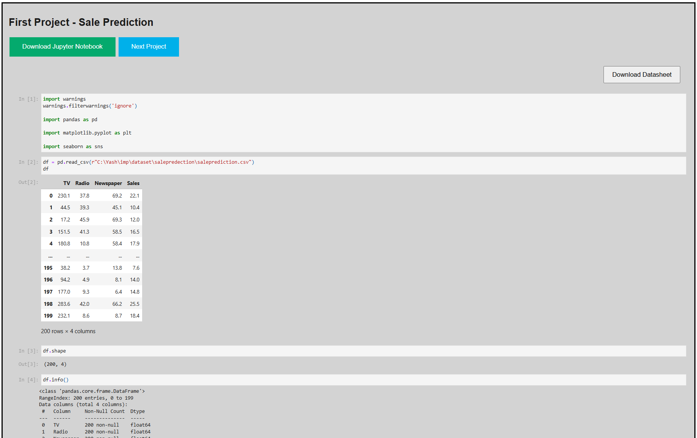
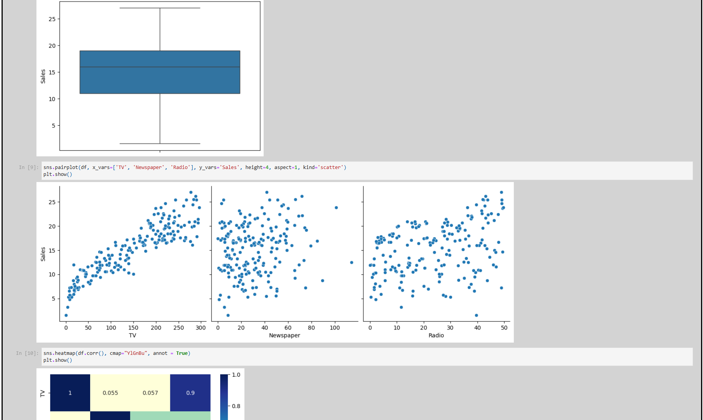
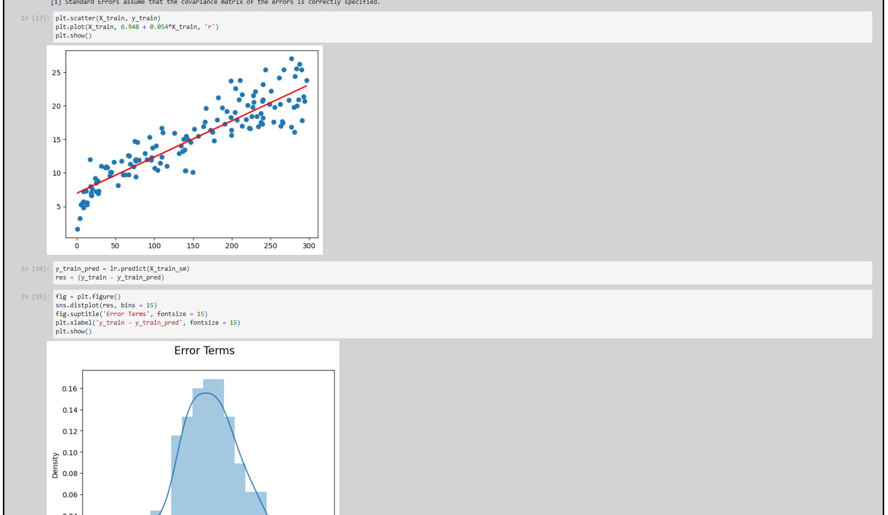
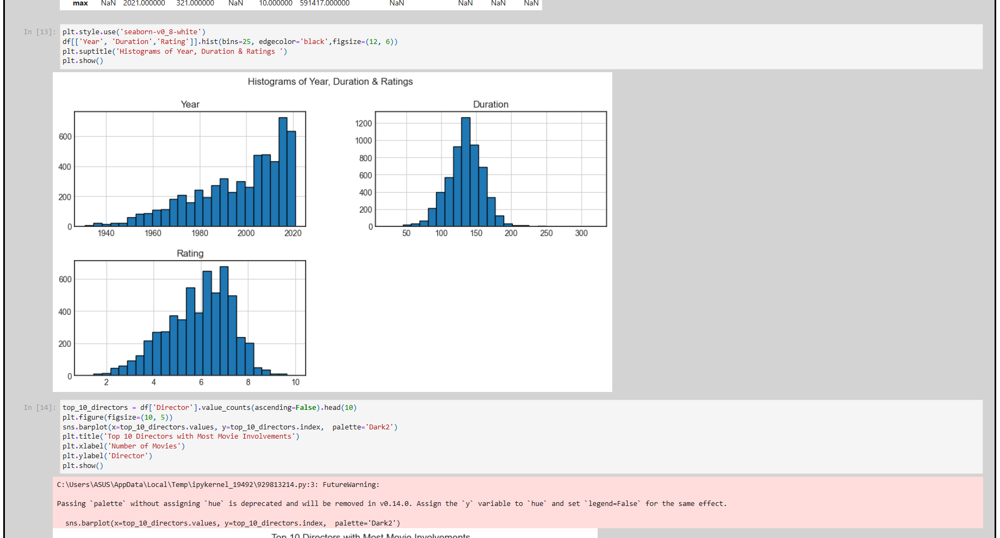
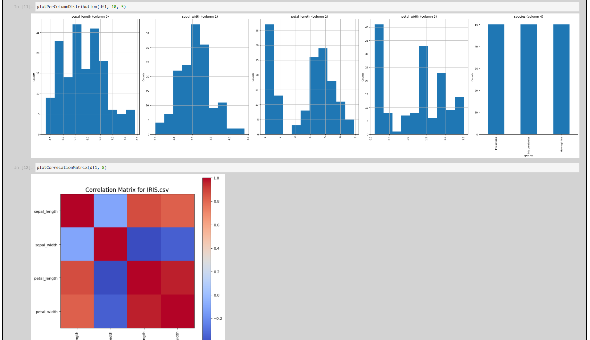

its a simple codesoft project website to view the progress stats

***
I'll work on Movie Rating Prediction, Sales Prediction, and Credit Card Fraud Detection using machine learning techniques like regression and classification. There will be data preprocessing, model selection, and evaluation for each task.
***

***
***
Project 1 - Sale Prediction
***

***

***

***
***
Project 2 - Movie Rating Prediction
***

***

***

***

***
***
Project 3 - Iris Flower Detection
***

***

***

***
